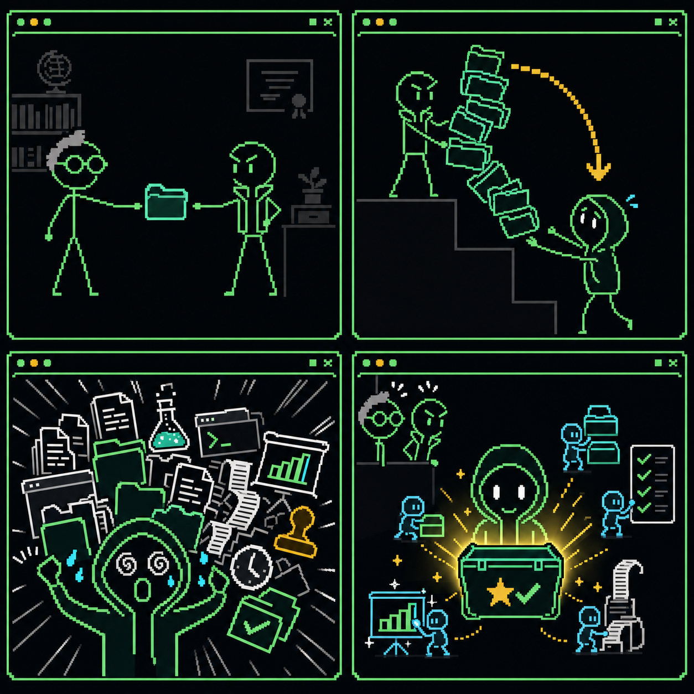

<p align="center">
  
</p>

```text
██████╗  █████╗ ███████╗███████╗
██╔══██╗██╔══██╗██╔════╝██╔════╝
██████╔╝███████║███████╗███████╗
██╔═══╝ ██╔══██║╚════██║╚════██║
██║     ██║  ██║███████║███████║
╚═╝     ╚═╝  ╚═╝╚══════╝╚══════╝
     Project Allrounder Skill Suite
```

> **PASS — Project Allrounder Skill Suite**：从项目指南到验收结项，面向课题组横纵项目全生命周期。

[English](README_EN.md) · 中文

> [!NOTE]
> 三个 Skill 已进入 `main` 并通过首轮结构、脚本和前向场景测试；首个版本标签尚未发布。

## 三个 Skill

| Skill | 用途 |
|---|---|
| `project-allrounder` | 管理项目主档案、任务、进度、风险、经费证据、验收和结项 |
| `writing-project-proposals` | 分析指南和需求，对照优秀本子，辅助论证、审稿和提交检查 |
| `building-project-presentations` | 制作申报、开题、中期、技术评审、验收和结项 PPTX |

三个 Skill 可以独立使用，也可以由 `project-allrounder` 统一调度。

## 工作流

```text
指南 / 客户需求
  → 资格与需求分析
  → 优秀案例对照
  → 申报与立项
  → 任务分解和项目开发
  → 进度、成果与经费管理
  → 汇报 PPT 和答辩
  → 验收、结项与归档
```

计划支持国自然、国家社科、重点研发、省市和校级纵向项目，以及企业横向项目。

## 安装

可从 `main` 使用 Codex 自带的 Skill Installer 安装：

```bash
python "${CODEX_HOME:-$HOME/.codex}/skills/.system/skill-installer/scripts/install-skill-from-github.py" \
  --repo DocZbs/project-allrounder-skills \
  --path \
    skills/project-allrounder \
    skills/writing-project-proposals \
    skills/building-project-presentations
```

## 使用示例

```text
使用 project-allrounder 分析这份项目指南，建立项目主档案，
列出申报要求、考核指标、任务计划和未来验收证据。
```

```text
使用 writing-project-proposals 对照合法公开的优秀同类项目，
审查我的申报思路，指出问题、创新、路线和前期基础之间的缺口。
```

```text
使用 building-project-presentations 根据任务书、进展和成果证据，
制作一份 15 分钟的中期汇报 PPTX，并准备专家问答。
```

## 合规边界

- 不虚构事实、参考文献、成果、预算或验收证据。
- 当前指南、任务书、合同和单位制度优先于历史案例。
- 国自然相关任务遵守当年生成式 AI 使用、核验、声明和标识要求。
- 合同、知识产权、财务和报销内容仅作辅助检查，不代替正式审批。
- 横向项目的商业数据和未公开材料默认只在用户授权范围内处理。

详细设计见[设计文档](docs/superpowers/specs/2026-07-20-project-allrounder-skill-suite-design.md)。代理开发规则见 [AGENTS.md](AGENTS.md)。

## License

[MIT License](LICENSE)
